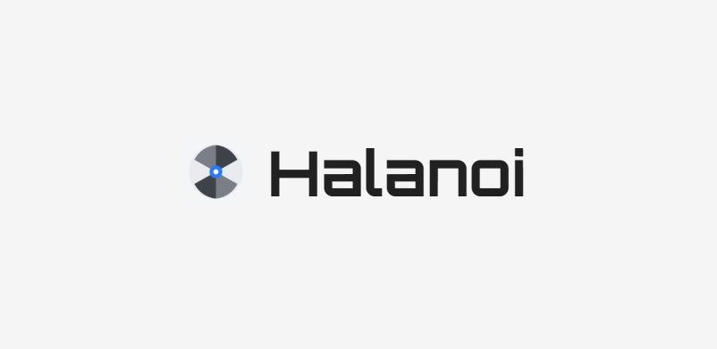
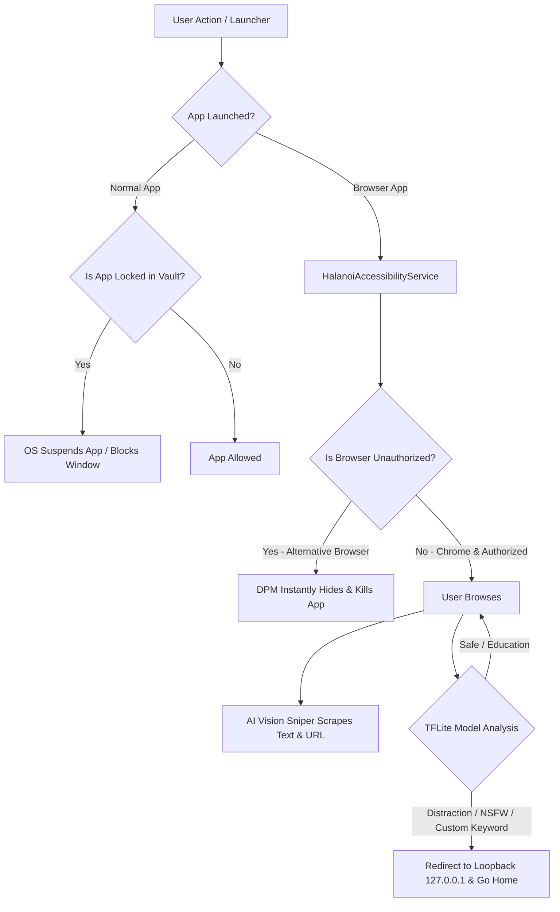

# Halanoi Sovereign 🛡️
### High-Security Offline Android Focus & Anti-Distraction Engine

<p align="center">
  
</p>

<p align="center">
  <b>Halanoi Sovereign</b> is a professional-grade, open-source focus lockdown utility for Android. By utilizing <b>Device Owner</b> administrative privileges (similar to corporate IT policies) combined with a local <b>Edge AI Screen Sniper</b>, Halanoi makes it virtually impossible to bypass your focus session or sneak past your study blocks.
</p>

<p align="center">
  <a href="https://github.com/kavinmaranravi/HalanoiApp/releases"></a>
  <a href="LICENSE"></a>
</p>

---

## 📸 Demo & Visual Proof

<p align="center">
  
  <br />
  <i>Demo showing the Screen Sniper detecting distracting content in real-time and immediately locking down the phone.</i>
</p>

---

## 🚀 Key Features

### 1. Local AI Vision & Text Sniper 🧠
*   Powered by a **64MB local TFLite transformer model** (`halanoi_transformer.tflite`) running offline on-device.
*   Scrapes active text, search queries, inputs, and browser URL bars in real-time.
*   Classifies content into harmful/distracting categories (NSFW, entertainment, sports, politics) or custom keywords (e.g. "skibidi").
*   If classified above the confidence threshold, it instantly redirects the browser to `http://127.0.0.1`, hits Home, and locks the screen.

### 2. Browser Lockdown Shield 🌐
*   **Standard Mode**: Allows Google Chrome (controllable via the app Vault), but **permanently blocks and hides** all other alternative browsers (Opera, Brave, Firefox, etc.) to prevent bypasses.
*   **Chrome-Only Mode**: Disables and hides all browsers on the phone except Google Chrome.
*   **Zero-Browser Mode**: Completely disables and hides all web browsers (including Chrome) for a total web blackout.
*   **Active Store Scanner**: Runs background scans while you browse the Google Play Store, Vivo App Store, or package installers. It automatically detects and hides new browsers the moment they are installed.
*   **Hydra Auto-Hide**: If an unauthorized browser is opened, it is instantly hidden and killed via the OS, removing its launcher icon.

### 3. OS-Level Device Owner Lockdown (God Mode) 🔒
*   **Anti-Uninstall Guard**: Prevents the app from being uninstalled.
*   **Anti-Clear-Data Guard**: Greys out "Force Stop" and "Clear Data" inside the Android App Info settings.
*   **Settings Freeze**: Locks the Accessibility Settings menu so the Accessibility Service cannot be disabled.
*   **Anti-Factory-Reset Guard**: Greys out the factory reset settings to prevent bypassing blocks by wiping the device.
*   **VPN Lockdown**: Prevents turning off or modifying the local VPN Network Shield.
*   **Sideloading Guard**: Revokes permission to install unknown apps, blocking manual APK installations from WhatsApp, Chrome downloads, or File Managers.

---

## 📐 System Architecture

Here is how the VPN Shield, Accessibility Service, and Device Policy Manager collaborate locally:



---

## 🛠️ Step-by-Step Setup Guide

Setting up Halanoi Sovereign requires setting it as a **Device Owner** using Android Developer Options and a PC.

### Prerequisites:
1.  Enable **Developer Options** on your phone (Tap *Build Number* 7 times in Settings).
2.  Enable **USB Debugging** inside Developer Options.
3.  Install **ADB (Android Debug Bridge)** on your computer.

### Installation & Activation:

1.  **Remove Google Accounts** (Android OS Security Requirement):
    Go to `Settings > Accounts` on your phone and temporarily **remove all Google and manufacturer accounts**. 
    *   *Why? Android security rules only allow setting a Device Owner if no user accounts are currently active on the device. You can immediately re-add them after Step 4.*
2.  **Build & Install the APK**:
    Build the debug APK and install it on your device:
    ```bash
    ./gradlew installDebug
    ```
3.  **Set the Device Owner via ADB**:
    Connect your phone to your PC via USB and run this command in your PC terminal:
    ```bash
    adb shell dpm set-device-owner com.halanoi.app/.HalanoiDeviceAdminReceiver
    ```
    *You should see a success message: `Success: Device owner set to package...`*
4.  **Re-add Accounts**:
    Go back to `Settings > Accounts` and log back into your Google and manufacturer accounts.
5.  **Enable Accessibility Service**:
    Open Halanoi Sovereign on your phone, follow the prompts to enable the **Halanoi Accessibility Service**. The app will now lock its own settings and VPN in place.

---

## 🔄 How to Update Safely

Because the app is protected by active uninstall guards, you cannot update it by uninstalling it first. To update the app, you must **install it in-place** (overlaying the update):

Ensure your phone is connected to your PC with USB debugging, and run:
```bash
adb install -r app-debug.apk
```
*The `-r` flag tells Android to replace/reinstall the app in-place, keeping all your settings and keeping the Device Owner active.*

---

## ❌ Removing the Device Owner (Uninstalling)

If you need to uninstall the app, you must first strip it of its Device Owner status.

Run the following command from your PC terminal:
```bash
adb shell dpm remove-active-admin com.halanoi.app/.HalanoiDeviceAdminReceiver
```
Once the admin status is removed, you can uninstall the app normally from your phone settings.

---

## 🤝 Acknowledgements
*   **Cloudflare Family DNS (`1.1.1.3` / `1.0.0.3`)**: For providing robust, high-speed, and secure public DNS resolvers that filter adult content at the network layer.

---

## 📝 License
This project is open-source and licensed under the **GNU General Public License v3.0 (GPL-3.0)**. 